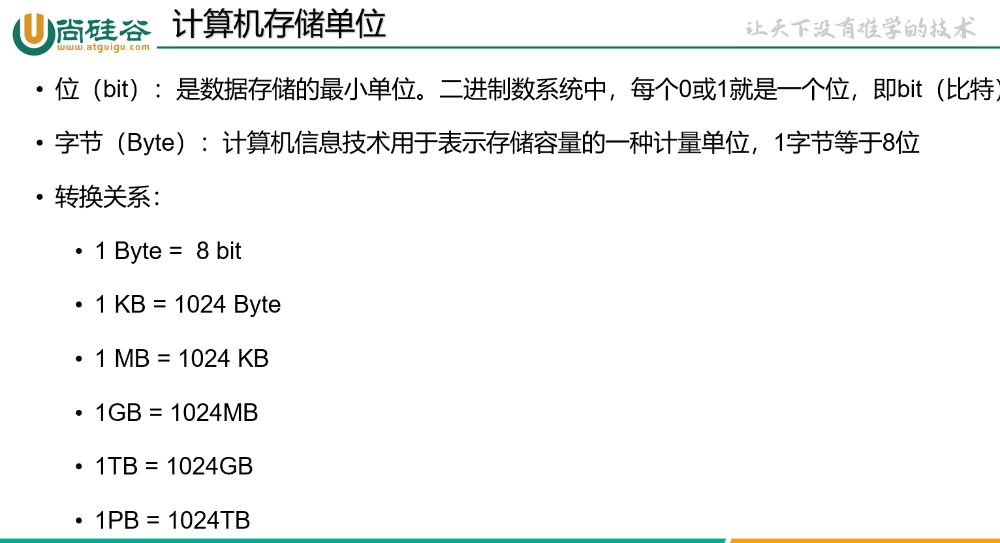

# 一,计算机Dos的基本命令


# 二、编程语言概述

Java诞生于SUN公司，现在归属于Oracle（甲骨文）公司。

Java在1996年初正式发布JDK1.0版。

Java之父詹姆斯.高斯林。

Java的最新版本是22，最新长期支持版本21。企业中用的版本主要是Java8，Java17。

# 三、环境搭建

## 3.1 安装JDK

https://www.oracle.com/cn/java/technologies/downloads/

下载网站.

## 3.2配置环境

安装路径不要有空格、中文等特殊符号.


环境测试

```java
javac -version
    
java -version
```

在CMD下输入上面的两行代码,可显示Java 的版本.两条代码输入后所显示出的版本应该一致.

## 3.3 配置环境变量

**环境：**这里的环境是指Java程序的运行环境，主要是指操作系统的环境。

**变量:**用一个单词来表示一些值,例如:用path单词代表一些路径,这里的路径是指程序路径,例如javac.exe程序的路径.

**设置环境变量:**右键点击此电脑->属性->高级系统设置->高级->环境变量->系统变量Pash->添加或删除.

# 四.java的语法

## 4.1 注释

**单行注释:** //一行注释内容.

**多行注释**:/*   1行或多行注释内容 */

**文档注释:**/** 有严格格式要求的注释内容* */

​					其中的文档注释是可以配合Javadoc.exe工具生成API文档.

## 4.2关键字

**关键字**是有特殊意义的单词.如:public calss static void 等,**注意**所有关键字都小写,写完之后会有特殊的颜色标识.


## 4.3标识符

**标识符:**是在程序中给类、变量、方法等取名字的单词就是标识符.如:a,b,age,name.

**标识符的命名规则:必须要遵守的硬性规则.**

(1) Java的标识符只使用:26个英文字母大小写,0-9的数字,下划线_,美元符号$.(理论上Unicode字符集中所有字符都可以用)

(2)不能使用Java的关键字(包括保留字)和特数值(null,true,false)

(3)数字不能开头.

(4)不能包含空格.

(5)严格区分大小写.

**标识符的命名规范:建议遵守的软性规则.**

(1)见名知意

(2)类名,接口名等等,每个单词的首字母都要大写,格式XxxYyyZzz;

(3)变量、方法名等:从第二个单词开始首字母大写,其余字母小写.格式xxx.Yyy.Zzz;

(4)包名等:每一个单词都小写,单词之间用"."分割,格式:com.zhang.jia.ming.注意:自己命名的包不能以java开头,习惯上以公司的域名倒置的写法,

(5)常量名等:每一个单词都大写,单词之间用下划线分割,格式XXX_YYY_ZZZ.

## 4.4 Java的数据类型

Java 是强类型语言,对数据类型非常严格.


基本数据类型(8种):

* boolean是独立的
* byte<short或char<int<long<float<double

引用数据类型(各种对象):

* 类:凡是class定义的都是类,String也是一个类.
* 数组,接口,枚举,注解,记录.

##### 各种数据类型的宽度

```java
byte:1个字节
short:2个字节
int:4个字节
long:8个字节
float:4个字节
double:8个字节
char:2个字节
boolean:1个bit位
```

##### 1个byte可以存储的整数范围


##### 各种整数类型存储范围


##### 小数是如何存储的

* float和double比所有整数类型的存储范围大
* float和double的计算结果是有误差的


##### 字符是如何存储的


ASCII表的后面128个字符,在各个国家都不统一.

ASCII表无法表示中文等字符,各个国家又指定了GB2312,后来发展为GBK.每个国家都有自己的编码表.

但是如果想要在同一篇文章中,或同一段代码中出现中文、日文、韩文等就无法处理了.这个时候就需要一个万国码,他就是Unicode字符集,他收录了世界上所有国家的常用字符,这些字符共65536个,编码值得范围是0~65535.Java程序中的字符就是采用Unicode字符集.

但是所有的编码表对ASCII表都兼容,只是兼容前面128个字符.

每一个字符在JVM中占用2个字节.

在程序中可以用编码值来表示一个字符

* 十进制编码值表示
* 十六进制编码值表示;写法"\\uxxxx",必须是4位十六进制值.

##### boolean类型的存储

用一个二进制位表示即可,0表示false,1表示true.但是Java中只能写true或false.

## 4.5 Java的各种常量值

### 4.5.1各种常量值


### 4.5.2 转义字符


\t可实现简单的控制台对齐效果.

无论是在单引号里面还是双引号里面，\n，\r，\t，\b，\\都需要转义。

## 4.6 Java的变量

**变量:**就是用一个标识符代表一个值,标识符中的值在程序运行期间可能发生变化,变量的值存储在JVM(Java虚拟机)的内存中.

总的来说:变量就代表一个值,或代表一块内存区域.

### 4.6.1变量的格式

声明格式

```java
数据类型 变量名;

数据类型 变量名 = 初始值;
```

注意:只要在变量名前面加数据类型,就表示定义一个新的变量.

赋值格式:

```java
变量名 = 值1;
变量名 = 值2;
```

**注意:**同一个变量可以被反复赋值;


### 4.6.2 变量使用的注意事项

* 变量有严格的作用域:作用域看{},超出{}就不能用了
* 同一个作用域中不允许重复声明,即通一个作用域中两个变量不能重名.
* 变量可以反复赋值,但是值得类型必须 **小于等于** 变量的类型.
* 变量必须先声明后使用,否则编译会报找不到符号错误.
* 变量在使用之前必须初始化,否则编译会报未初始化的错误.

## 

## 4.7 final声明变量成为常量

final 数据类型 名 =值

## 4.8 普通变量与常量的区别


# 五、进制与计算机存储原理

## 5.1进制分类


## 5.2进制换算

| 十进制 | 二进制 | 八进制 | 十六进制 |
| ------ | ------ | ------ | -------- |
| 0      | 0000   | 0      | 0        |
| 1      | 0001   | 1      | 1        |
| 2      | 0010   | 2      | 2        |
| 3      | 0011   | 3      | 3        |
| 4      | 0100   | 4      | 4        |
| 5      | 0101   | 5      | 5        |
| 6      | 0110   | 6      | 6        |
| 7      | 0111   | 7      | 7        |
| 8      | 1000   | 10     | 8        |
| 9      | 1001   | 11     | 9        |
| 10     | 1010   | 12     | A 或 a   |
| 11     | 1011   | 13     | B 或 b   |
| 12     | 1100   | 14     | C 或 c   |
| 13     | 1101   | 15     | D 或 d   |
| 14     | 1110   | 16     | E 或 e   |
| 15     | 1111   | 17     | F 或 f   |
| 16     | 10000  | 20     | 10       |
| 17     | 10001  | 21     | 11       |
| 18     | 10010  | 22     | 12       |


## 5.3 数据存储单位



## 5.4 各种数据类型的存储原理

### 5.4.1 符号位


### 5.4.2 原码、反码、补码

#### 1.正负数原码、反码、补码规则

* 整数:原码、反码、补码都一样,称为三码合一.
* 负数:原码、反码、补码不一样.
  * 负数原码:最高位是1,其余数据位与其绝对值的原码一样
  * 负数反码:最高位不变,其余数据位在原码基础上取反,0变1,1变0
  * 负数补码:在负数反码的基础上+1.

#### 2.十进制到二进制

人工算原码、反码、补码


得到原码之后在分别根据正负数规则算反码、补码.

##### 计算机算补码

* 确定字节数量

* 输入十进制,直接得到补码的二进制

  例如 (以四个字节为例)

  十进制 25

  二进制 0000 0000 0000 0000 0000 0000 0001 1001


#### 3.二进制到十进制

##### 人工算补码、反码、原码

* 人工

* 先从补码得到**原码**

* 然后吧除了符号位之外的所有二进制位为1的**权值**加起来

* 例如 :(以一个字节为例)

  二进制:0001 1001 (补码) ->0001 1001(反码) ->0001 1001(原码) 十进制:25.


##### 计算机补码

* 先确定字节数
* 在吧二进制补码粘贴到计算机中
* 例如:(以1个字节为例)

二进制补码:0001 1001

十进制:25


# 六 各种数据类型的转换

## 6.1从小到大:自动类型转换

1.当把小的数据类型的值,赋值给大的数据类型的变量时,会自动类型提升.

2.当byte不byte,short与short,char与char,或者它们3个运算,都会自动升级为int.

* 因为JVM底层的质量没有byte,short,char的指令,直接使用的是int类型的指令.

3.当多数数据类型混合运算时,最终结果是它们当中最大的类型.

## 6.2从大到小:强制类型转换

1.当把大的数据类型的值,赋值给小的数据类型的变量时,需要强制类型转换.强制类型转换有风险,可能溢出或损失精度.

2.有时候会用强制类型转换来故意提升某个变量的类型.

# 七、运算符

## 7.1赋值运算符


## 7.2 二元运算符


## 7.3赋值运算符与算数运算符结合


## 7.4 一元算数运算符


## 7.5 哪些运算符会"修改"变量的值


## 7.6比较关系运算符


## 7.7 逻辑运算符


## 7.8 条件运算符


## 7.9 移位运算符


总结:

* 只有负数右移,左边是补1,其余都补0
* 正数和负数的左移,负数的无符号右移,符号位会发生变化,其余符号位不会发生变化.
* 左移和右移可以使用快速口诀,但是快速口诀的结果可能是由溢出或正负号发生变化等情况
* 当要移动的位数是负数,或者超过当前计算机类型的总位数时,会先处理要移动的位数,例如:int类型的a
  * a<<35,相当于a<<(35-32)
  * a<<-30,相当于a<<(32-30)

### 左移


### 右移


### 无符号右移


## 7.10 按位与或异或等运算符


### 按位与


### 按位或


### 按位异或


### 按位取反


## 7.11 位运算符与赋值运算符结合


## 7.12 运算符的优先级


# 八、流程控制语句结构

流程控制语句结构分为3种

* 顺序结构:从上往下"依次"执行
* 分支结构:根据条件"有选择"的执行某些语句
* 循环结构:"重复"执行某些语句

## 8.1输入输入语句

### 8.1.1输出语句

```java
System.out.println(xx)//输出xx之后换行
System.out.print(xxx)//输出xxx之后不换行
```

### 8.1.2 输入语句

他是用于当程序运行后,接收用户从控制台输入的数据.

#### 步骤

* 第一步:在(class)类的上方加一个语句

  * ```java
    import java.util.Scanner;
    ```

  * 这句代码的作业是告诉JVM到java.util包下找Scanner类的Scanner.calss文件

* 第二部:在main方法中,在接收用户输入的数据之前,加一句语句.

  * ```java
    Scanner input = new Scanner(System.in);
    input 是一个变量名,他代表用于键盘输入的一个工具,一个对象.
    ```

* 第三步:用一个输出语句,提醒用户需要输入xxx的数据.

  * ```java
    System.out.print("请输入您的XXX:")
    ```

* 第四步:接收用户在控制台用键盘输入的数据
  * **int**类型的变量 = input.nextInt();
  * **char**类型的变量 = input.next().charAt(0);
  * String类型的变量 = input.next();
  * double类型的变量=input.nextDouble();
  * boolean类型的变量 = input.nextBoolean();

* 第五步:如果所有的输入工作完成了,那么建议大家调用close方法释放资源

  * ```java
    input.close();  // Java程序如果涉及到输入,输出,需要操作系统取调用硬件的相关驱动代码啥的,这个时候,操作系统就会额外的分配内存来管理这些信息,当我们用完之后,这个内存西药释放,否则可能会造成内存泄漏.因为操作系统是C语言写的,C语言需要手动释放内存.
    ```

## 8.2 分支结构之条件判断

### 8.2.1 单分支条件判断

语法格式:

```java
if(条件表达式){
    语句;
}
```

执行的特点:if条件成立,就执行{}里面的语句,不成立就不执行.

说明:

* if()里面的条件表达式结果必须是boolean值,只有boolean值才能当条件,true表示条件成立,false表示条件不成立.
* {}中如果只有一条语句,{}可以省略.

### 8.2.2 双分支条件判断

语法结构:

```java
if(条件表达式){
    语句1;
}else{
    语句2;
}
```

执行特点:当if 条件成立,就执行语句1,不成立就执行语句2.

说明:

* if()里面的条件表达式必须是boolean值,只有boolean值才能当条件,true表示条件成立,false表示条件不成立.
* {}中如果只右一条语句,{}可以不用写.

### 8.2.3多分支条件判断

```java
if(条件表达式1){
    语句1;
}else if(条件表达式2){
    语句2;
}else if(条件表达式3){
    语句3;
}......
    else{
        语句n+1;
    }
```

执行特点:

* 从上往下依次判断条件,如果上面有条件成立了,下面所有条件都不看了.如果上面条件不成立,继续看下面的条件.
* 如果上面的所有条件都不成立,如果最后又一个else分支,那么就执行最后的else分支.

## 8.3分支结构之选择结构

语法结构:

```java
switch(表达式){
    case 常量值1:
        语句1;
        break;
    case 常量值2:
        语句2;
        break;
    case 常量值3:
        语句3;
        break;
    default:
        语句;
}
```

**注意**:switch-case有穿透性,如果想要避免从上面的分支直接穿透到下面的分支,需要加一个关键字;break

执行特点:

(1)入口

* case入口;当switch(表达式)的值与case后面的常量值匹配了,就从这个case进入.
* default入口:当所有的case都不匹配的时候,会寻找default进入.

(2)(出口)

* 自然出口:如果没有break,那么就是执行完所有分支,自动结束switch.
* 中断出口:如果遇到break,直接结束switch.

(3)注意穿透性:无论从什么入口进入的,都要注意穿透性.

另外,switch结构有要求:

* switch(表达式)中的值类型有限制,只支持byte,short,char,int四种基本数据类型,String,枚举两种引用数据类型.
* case后面的常量值不能重复.
* case后面只能写常量值,不能写变量值.

8.4 if-else 与 switch-case有什么区别

* if-else的适用面更广,而switch-case只适用于集中常量值的判断情况
* switch-case有穿透性,利用穿透性可以简化代码,而if-else没有穿透性.
* switch-case的效率比if-else高

## 8.4 循环结构

循环结构的作用:"重复"执行某些语句.

循环结构的形式:

* for循环
* while循环
* do-while循环

三种循环结构的作用是一样的,完全可以互换.只是三种结构更习惯使用的场景有些不同.

## 8.5 关键字:break

break除了可以在switch-case中使用,用于终端switch的执行,也可以在3中循环中使用,用于**结束循环**.

## 8.6 for循环

### 1.无线循环或死循环

语法结构:

```java
for(;;){
    循环体语句块;//需要重复执行的语句
}
```

### 2.有限次数的循环

语法结构:

```java
for(1初始化表达式;2循环条件表达式;3迭代表达式){
    4循环体语句块;
}
```

* 循环变量:控制循环次数的变量,
* 1初始化表达式:为循环变量赋初始值的表达式;
* 2循环条件表达式:控制循环体是否执行的条件,当2为true时,循环体语句执行,当2为false时,for循环结束.
* 3迭代表达式:修改变量的值.
* 4循环体语句块:需要重复执行代码.

执行过程:

情况一:1>2false,直接结束for

情况二:1>2true>4>3>2>true>4>3>2true>4>3>......2false结束.

## 8.7 while循环

### 1.无限次的循环

语法结构:

```java
while(true){
    循环体语句块;
}

while(永远成立的循环条件){
    循环体语句块;
}
```

### 2.有限次的循环

```java
1循环体初始化表达式
    while(2循环条件表达式){
        4循环体语句块;
        3.迭代表达式;    
    }
```

执行特点:

情况一:1>2false,直接结束while

情况二:1>2true>4>3>2true>4>3......>2false 结束while;

## 8.8 do-while循环

### 1.无线循环或死循环

```java
do{
    循环体语句块;
}while(循环表达式);

当循环条件表达式是true常量值,或永远成立的条件,那么上面的循环就是死循环
```

### 2.有限次循环

语法结构:

```java
1循环变量的初始化表达式
    do{
        4循环体语句块;
        3迭代表达式
    }while(2循环条件表达式);
```

执行特点:

情况一:1>4>3>2false,循环体语句执行了依次就结束了

情况二:1>4>3>2true>4>3>2true>4>3>2true......2false结束循环

## 8.8三种循环的对比

**相同点:**

1.都可以重复执行欧协语句

2.都可能出现死循环或无限循环

3.必须控制好条件,才能实现有限次数的循环

4.三种循环都有四要素:循环变量初始化,循环条件表达式,迭代表达式,循环体语句.

**不同点:**

1.do-while循环与其他两种循环的最大不同,就是do-while循环的循环体语句至少要执行1次,

2.通常情况下,当循环变量的范围比较明确,即循环次数很明显,例如:1-100的范围,那么优先考虑使用for.

当循环体语句至少执行一次时,一般考虑使用do-while.

当循环体次数不明显,但是循环条件比较明显,有没有说循环体至少执行1此,那么烤炉使用while.

**注意:**三种循环一定是可以互换.

## 8.9 循环嵌套

当一个for,while,do-while{循环体}里面又嵌套了另一个循环,这个循环也可以是for,while,do-while,呢么这样的结构称为嵌套循环.

```java
for(....;....;....){//外循环
    for(....;....;....);{//内循环
        
    }
}

while(条件){//外循环
    for(....;....;....){//内循环
        
    }
}

for(....;....;....){//外循环
    while(条件){//内循环
        
    }
}

//任意嵌套
```

循环的执行过程:外循环循环一次,内循环执行一轮.

# 九、数组

## 9.1 什么是数组(数组的概念)

**数组:**是一种容器,一种数据类型,用来装一组数据的容器,用来管理一组数据的结构.

例如:可以用一个int类型的变量存储一个整数,现在可以用int[]类型数组存储一组数据.

```java
int a = 35;//一个数据
int[] arr = {5,6,7,8,9};//一组数据
```

### 9.1.1 数组的一些名词概念

1.**数组名**:将有限个类型相同的变量的集合命名,那么这个名称为数组名.例如:int[]arr,这里的arr就是数组名.

2.**数组的元素**:组成数组的各个变量(即数据)称为数组的元素.例如:int就是数组元素的类型,arr[0],arr[1],arr[2]等代表数组的元素.arr[0],arr[1],arr[2]等他们也是变量.

3.**数组的下标**:每一个元素需要有一个编号来表示它,arr[0],arr[1],arr[2]等,中的[0],[1],[2]就是下标.注意java中数组的下标从[0]开始.

4.**数组的长度:**数组中元素的总个数就是数组的长度,它可以通过数组名.length来表示,例如:arr.length就是数组的长度.

## 9.2 数组的声明和使用

### 1.声明的格式

```java
元素的类型 [] 数组名;
//数组名,自己定义,它是一个标识符,是一个变量名,从第二个单词开始首字母大写.
//元素的类型,由数组中数据来决定.
```

### 2.数组的初始化

初始化要确定两个事;

* 数组的长度,即数组一共有几个元素.因为数组这种结构有个特点,就是长度一旦确定就不能更改.
* 数组的元素值,

数组的初始化方式有两种;

* 静态初始化
* 动态初始化

#### (1)数组的静态初始化

```java
数组名 = new 元素的类型[]{元素1,元素2,元素3,......};
```

当数组的声明和静态初始化合起来写:

```java
元素的类型[] 数组名 = new 元素的类型 []{元素1,元素2,元素3,......};//此时可以省略new 元素的类型[]
元素的类型[] 数组名 = {元素1,元素2,元素3......}
```

#### (2)数组的动态初始化

```java
元素的类型[] 数组名;
数组名 = new 元素的类型[长度];

元素的类型[] 数组名 = new 元素的类型[长度];
```

### 3.数组的遍历方式

- 普通for循环
- 增强for循环

#### 区别:

- 关于下标

  - 普通for循环是有下标的,也必须指定下标,可以指定下标范围,控制遍历数组的全部还是一部分.

  - 增强for循环是没有下标的,也不能指定下标.只能从头到尾遍历整个数组.

- 是否可以修改元素的值
  - 普通for循环可以修改元素的值
  - 增强for循环不可以修改元素的值,只能看.
- 数组的内存分析
  - 数组是new出来的,他的元素是存储在堆中,在堆中开辟连续的一整块存储空间,每一个元素通过编号(即下标)进行区分.
  - 数组名里面记录了数组的"首地址".打印数组名时,无法看到数组的元素.只能看到"虚拟地址"的效果.


## 9.3 二维数组

## 9.3.1二维数组的作用

一维数组书用来存储和管理一组数据的.例如:一个小组的成绩可以用一维数组存储.

二维数组是用来存储和管理"多"组数据的.

## 9.3.2二维数组的声明

语法格式:

```java
元素的类型[][] 数组名
    
元素的类型 数组名[][];
元素的类型[] 数组名[];
```

## 9.3.3 二维数组的初始化

#### 静态初始化

```java
元素的类型[][] 数组名;
数组名 = new 元素的类型[][]{{元素1,元素2,元素3,...},{元素1,元素2,元素3,...},{...}};
```

当声明与静态初始化在一个语句完成,可以省略右边的new元素的类型\[][].

```java
元素的类型[][] 数组名 = {{元素1,元素2,元素3,...},{元素1,元素2,元素3,...},{...}}; 
```

